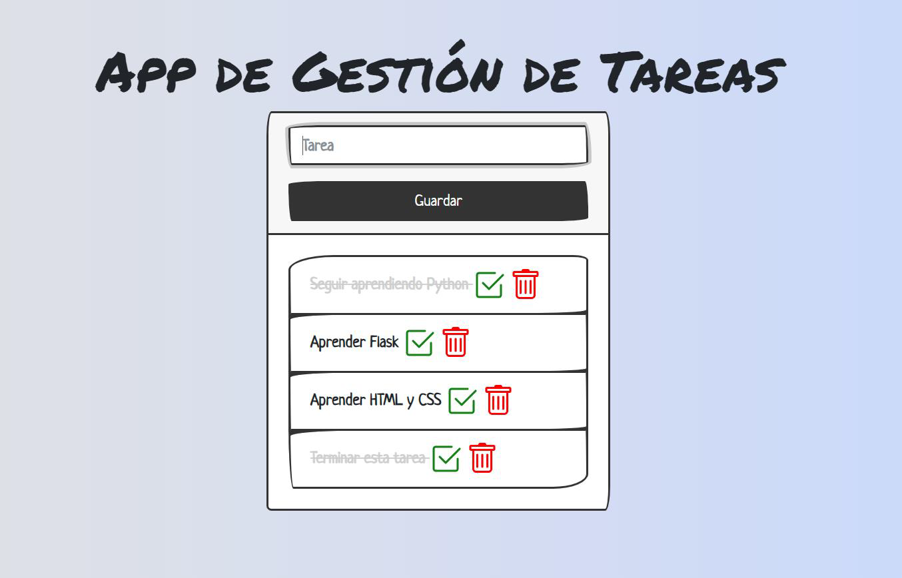

# Tokio: Modulo 6
Practicando se aprende

## Práctica 1
Creación de una app web con base de datos

### Descripción
En esta práctica se va a crear una página web con conexión a una base de datos. 
Esta aplicación web tendrá como objetivo ser un gestor de tareas, es decir, una 
aplicación que permitirá al usuario realizar las siguientes acciones:
- Crear tareas
- Marcar como completada una tarea
- Eliminar tareas

### Pantallas de Ejemplo
- App de Gestión de Tareas

### Tecnologías a utilizar
El stack tecnológico que se usará en este proyecto es el siguiente:

- Python 3. Como lenguaje de programación base.
- Jetbrains Pycharm Community. IDE escogido para el desarrollo del proyecto.
- Flask. Framework web para Python. Simple, minimalista pero muy potente.
- SQLite. Base de datos SQL rápida y potente para instalaciones de tamaño moderado.
- Virtualenv. Entorno virtual de Python donde se programará el proyecto.
- SQLAlchemy. Es un módulo de Python, el cual hace de Aplicación ORM (Mapeo objeto-relacional) que permitirá trabajar con la base de datos (SQLite en este caso) de forma más sencilla, trabajando con objetos de programación y no con las tablas, sintaxis y particularidades de la base de datos escogida. En resumen, es una aplicación que facilitará la gestión y comunicación con la base de datos desde Python.
- Google Fonts. Fuentes más bonitas que las fuentes estándar.
- Bootstrap. Librería de componentes gráficos y maquetador de diseño.
- uiGrandients. Generador de fondos con degradado.
- Jinja. Motor de renderizado de páginas web.

### Mejoras y entrega de la práctica
Mejoras que se pueden realizar a la práctica
- [X] Cambiar y mejorar la interfaz gráfica
- [X] Añadir un campo Categoría para la tarea
- [X] Añadir un campo de Fecha límite para la tarea
- [X] Posibilidad de Editar la tarea

### Entrega de la práctica:
- [X] **Realizar un documento de texto con capturas de pantalla donde se vea el funcionamiento completo de la app (y de la base de datos)**
- [X] Generar el fichero **requirements.txt**
- [X] Eliminar tu entorno virtual (carpeta venv) para la entrega.
- [X] Comprimir en un fichero la carpeta completa del proyecto de Pycharm y el documento de texto y llamarlo: **M6_01_nombre_apellido1_apellido2.zip** (cambiando nombre y apellidos por los tuyos)
